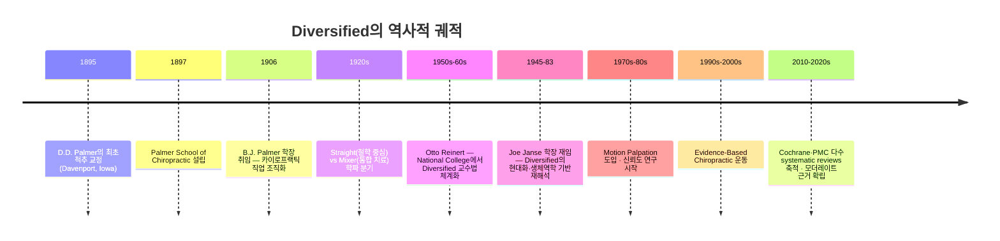
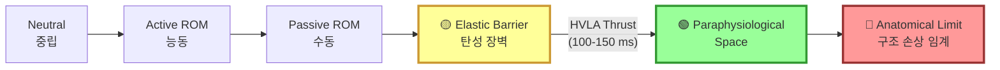
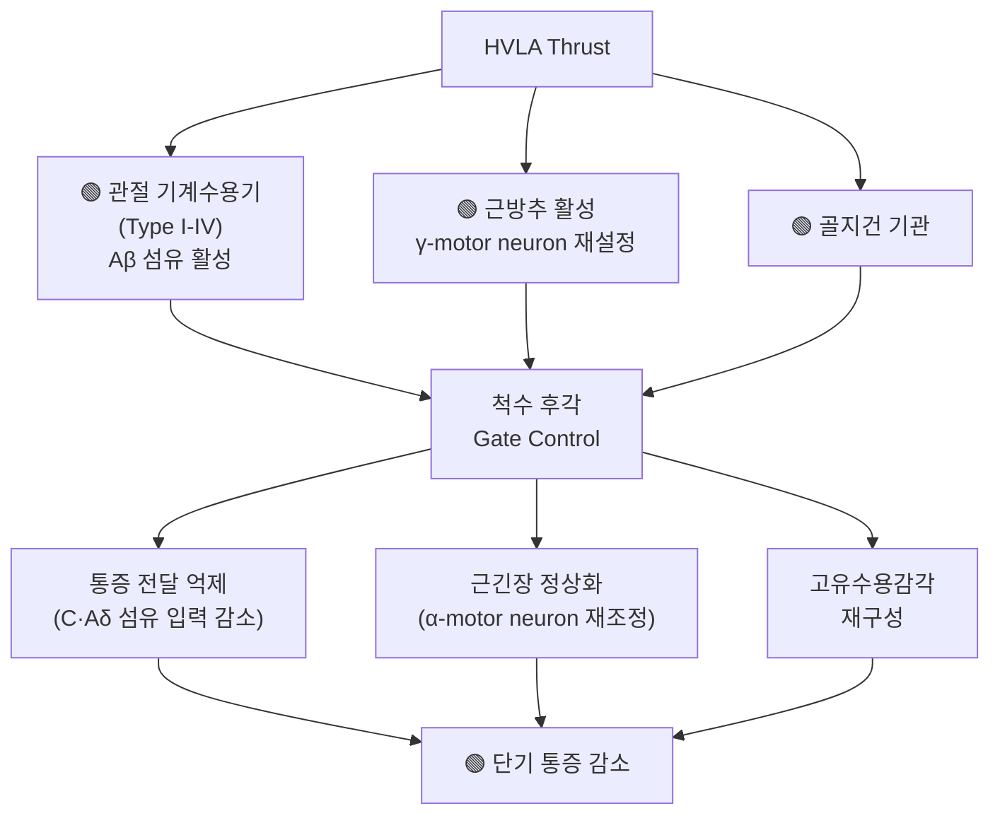
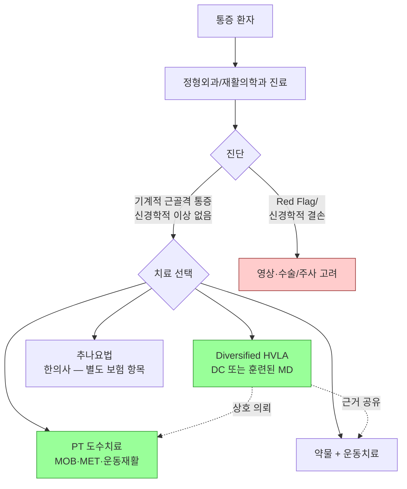
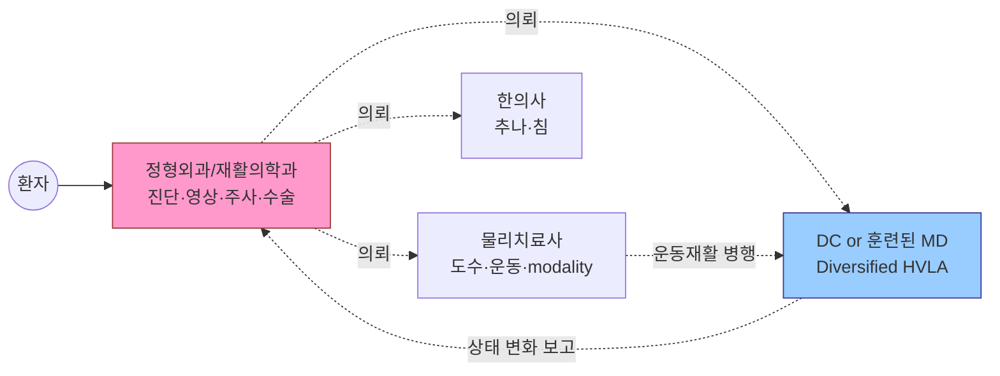

# Week 1. Diversified HVLA — 정의·생체역학·근거 개요

> **대상: 한국 정형외과·재활의학과 의사 및 도수치료 훈련 물리치료사**
> **관점: 근거 기반 의학(Evidence-Based Medicine) — 카이로프랙틱 pseudoscience는 비판적·최소 언급에 한함**

---

## 🎯 학습 목표

본 주차를 마친 후 학습자는 다음을 수행할 수 있어야 한다:

1. **수기치료 modality로서의 Diversified HVLA**를 정의하고, osteopathic HVLA(OMT)·물리치료 관절 가동술(MOB)·추나 HVLA와 구분할 수 있다
2. 고속 저진폭 추력의 **생체역학적 파라미터**(peak force, thrust duration, loading rate)를 제시할 수 있다
3. **관절 운동범위 4구역 모델**(Active / Passive / Paraphysiological / Anatomical)을 설명하고 HVLA가 개입하는 지점을 명시할 수 있다
4. **Cavitation의 과학적 기전**(Kawchuk 2015)을 설명하고, pop 소리와 임상 효과 사이의 상관관계에 대한 현행 근거를 평가할 수 있다
5. 전통적 "Subluxation 이론"의 한계와 현대 **Joint Dysfunction 모델**의 전환 근거를 논할 수 있다
6. Diversified HVLA의 **근거 수준**을 요통·경추통·두통별로 개략적으로 제시할 수 있다 (상세는 Week 4)
7. Carrick Functional Neurology, CBP, AK 등의 주변 테크닉 중 **현대 의학에서 수용 가능한 부분과 수용되지 않는 부분**을 구별할 수 있다

---

## ⚠️ 본 강의록의 편집 원칙 (Preamble)

이 강의록은 한국의 **면허 의사·물리치료사**를 대상으로 하며, 다음 원칙을 따른다:

| 포함 (Include) | 제외 (Exclude) |
|----------------|----------------|
| 생체역학·신경생리학 기반 설명 | Vitalism · "Innate Intelligence" 생기론 |
| Peer-reviewed 근거(Cochrane·PMC·JMPT) | "교정으로 전신 질환 치료" 주장 |
| WHO/NIH/ACA 공식 가이드라인 | 측정 불가한 추상 에너지 개념 |
| 안전성 통계·금기증 | 한의학 경락·기(氣)·음양오행 이론 |
| 의학 코드(CPT, ICD-10-CM) | 두개골 리듬·장기 직접 교정 주장 |

초기 카이로프랙틱의 철학적 주장(예: D.D. Palmer의 "Innate Intelligence", 척추 교정이 청력·내장 질환을 치료한다는 주장)은 **역사적 맥락에서만** 간략히 소개하며, 현대 의학의 수용 기준을 충족하지 못함을 명시한다.

---

# 🔬 제1부. Diversified HVLA의 의학적 정의

## 1.1 정의

**Diversified High-Velocity, Low-Amplitude (HVLA) spinal manipulation**은 다음 조건을 갖는 도수 의료 행위다:

- 특정 **척추 분절(segment)** 또는 말초 관절에 가하는 수기
- 탄성 저항을 넘어서는 **빠르고(< 100 ms) 짧은(1-3 mm)** 추력
- 관절이 생리적 운동범위 내에서 **탄성장벽(elastic barrier)을 일시 초과**하도록 유도
- 목표: 관절 저운동성(hypomobility) 해소 및 분절 기능 회복

## 1.2 표준 의학 코드

| 코딩 체계 | 코드 | 설명 |
|-----------|------|------|
| **CPT (미국)** | 98940 | Chiropractic manipulative treatment (CMT), 1-2 spinal regions |
| | 98941 | CMT, 3-4 spinal regions |
| | 98942 | CMT, 5 spinal regions |
| | 98943 | CMT, extraspinal (1+ regions) |
| **ICD-10-CM** | M99.0x | Segmental and somatic dysfunction |
| | M99.1x | Subluxation complex (vertebral) |
| **한국 급여** | 39014 | 추나요법 (단순) |
| | 39015 | 추나요법 (복잡) |
| | 39016 | 추나요법 (특수) — 탈구교정 포함 |

> **🟡 용어 주의**
> ICD-10-CM의 "Subluxation complex"는 **카이로프랙틱 고유 개념**으로, 정형외과에서 말하는 **불완전 탈구(subluxation, 관절면의 부분적 이탈)**와 다르다. 강의·논문에서는 혼동 방지를 위해 **Segmental dysfunction** 또는 **Joint restriction**이라는 용어를 권장한다.

## 1.3 유사 수기치료 Modality와의 구분

| Modality | 직역 | 수행 주체 | 힘·속도 특성 | 주요 차이 |
|----------|------|----------|-------------|----------|
| **Diversified HVLA (DC)** | 카이로프랙틱 | DC | 고속·저진폭 추력 | **분절 특이적 진단**(Motion Palpation) + 추력 |
| **Osteopathic HVLA (OMT)** | 접골 HVLA | DO | 고속·저진폭 추력 | 상위 5 Osteopathic models — Biomechanical·Respiratory 등 통합 |
| **Joint Mobilization (MOB)** | 관절 가동술 | PT | **저속·반복** (Maitland I-IV) | Thrust 없음 — 진동성 oscillation 중심 |
| **Muscle Energy Technique (MET)** | 근육에너지기법 | DO/PT | 환자 **등척성 수축** 활용 | 수동 교정 + 환자 자발 근 활성 |
| **추나 HVLA (KMD)** | 한의추나 | 한의사 | 고속·저진폭 가능 | 철학 배경(경락·기혈) 상이, 기법 요소는 유사 |
| **Manipulation under anesthesia (MUA)** | 마취하 도수치료 | MD/DO | 마취하 HVLA/stretch | 유착·극심한 근강직 시 |

> **💡 핵심 메시지**
> Diversified HVLA는 **고유한 "에너지 치료"가 아니다**. 기법적 핵심은 **분절 특이적 Motion Palpation 기반 진단**과 **탄성장벽 직전의 고속 저진폭 추력**이라는 **재현 가능한 의료 행위**다. OMT·추나 HVLA·MD 도수치료의 일부와 **기술적으로 중첩**하며, 상호 참조 가능하다.

---

# 🏛️ 제2부. 역사적 맥락 (간략)

> **📋 편집 주석**
> 역사는 **사실 기록**으로만 제시한다. 초기 철학적 주장(Innate Intelligence, 전신 질환 원인으로서 서브럭세이션 등)은 **현대 의학의 수용 기준을 충족하지 못한 가설**로 명시한다.

## 2.1 연대기

## 2.2 역사적 서사 vs 의학적 평가

| 초기 카이로프랙틱 주장 | 현대 의학의 평가 |
|----------------------|----------------|
| 1895년 D.D. Palmer가 T4 교정으로 Harvey Lillard의 청각장애를 회복시켰다 | **신뢰할 만한 의학적 기록 없음**. 해부학적으로 T4 분절이 청각 신경(CN VIII)에 직접 영향을 줄 경로 없음. **역사적 신화(mythology)**로 분류함이 타당. |
| "모든 질병은 척추 서브럭세이션에서 비롯된 신경 간섭에 기인한다" | **불인정**. 내장·전신 질환의 척추 기원설은 **근거 없음**. 카이로프랙틱은 **기계적 근골격 질환**에 한정한 근거가 축적되어 있음. |
| "Innate Intelligence가 척수를 통해 발현된다" | **형이상학적 개념** — 의학적 검증 불가, 과학적 담론에서 제외. |
| D.D. Palmer의 "3 원칙" (Tone·Innate·Specific Adjustment) | 현대 Diversified에서 **Specific Adjustment(특이 교정)** 개념만 **기계적 의미**(정확한 분절 targeting)로 재해석하여 유지. 나머지는 역사적 인용에 한정. |

## 2.3 Diversified의 "세속화" — Reinert·Janse의 기여

**Otto Reinert (1950s-60s, National College)**와 **Joseph Janse (1945-83, National College 학장)**는 Diversified를 **초기 카이로프랙틱 형이상학에서 분리**하여 **생체역학·신경해부학 기반**으로 재구성했다:

- **Palmer 전통의 Innate 언어를 제거**하고 **Joint dysfunction 용어** 도입
- **Motion Palpation**을 1차 진단 도구로 정립 (재현 가능·측정 가능)
- 척추 부위별(Cervical / Thoracic / Lumbopelvic / Extremity) **모듈형 교육과정** 구축
- National University of Health Sciences 현재 커리큘럼은 **생체역학·근거 중심** 표준

> **🔵 현대 Diversified의 정체성**
> 오늘날 미국 DC 95.9%가 사용하는 Diversified는 **Palmer의 형이상학적 카이로프랙틱이 아닌**, **Reinert·Janse 계열의 생체역학적 수기치료**에 가깝다. 의학 전문가 대상 강의에서는 이 계보를 명시적으로 구분하는 것이 정직한 접근이다.

---

# ⚙️ 제3부. HVLA 생체역학 — 측정 가능한 파라미터

## 3.1 추력의 힘-시간 프로파일 (Force-Time Profile)

Diversified HVLA의 표준 물리적 파라미터 (JMPT·PMC 다수 연구 종합):

| 파라미터 | 측정값 (평균) | 범위 | 임상 의의 |
|---------|-------------|------|----------|
| **Preload force** | 40–100 N | 부위별 | 조직 장력 구축, 탄성장벽 감지 |
| **Peak force** | 400–1,000 N | 흉추 > 요추 > 경추 | 관절 가동 범위 돌파 |
| **Thrust duration** | 100–150 ms | 80–250 | **근 방어 반사(~70 ms)보다 빠름** |
| **Loading rate** | 4,000–8,000 N/s | 높을수록 효과적 | 분절 가속의 핵심 |
| **Displacement** | 1–3 mm | 0.5–5 | Paraphysiological space 진입 |

> **🔵 연구 인용**
> Gudavalli MR et al. *Effects of thrust amplitude and duration of high-velocity low-amplitude spinal manipulations*. J Manipulative Physiol Ther 2013. — **진폭 1–3 mm, 지속 100–150 ms**가 cavitation 성공률과 환자 편안함의 최적 조합.

## 3.2 관절 운동범위 4구역 모델

<figure>
  
  <figcaption><strong>그림 1-1.</strong> 관절 운동범위의 4구역 모델. HVLA는 Passive ROM 말단의 Elastic Barrier 직전에서 Paraphysiological Space로 분절을 짧게 이동시킨다. <em>(일러스트 준비: 벡터 드로잉 또는 ResearchGate/JMPT 도표 재사용 CC 라이선스 확인)</em></figcaption>
</figure>

| 구역 | 범위 | 임상 의미 |
|------|------|----------|
| **Active ROM** | 환자 자발 움직임 | 근력·협응 평가 |
| **Passive ROM** | 술자 유도 수동 | 관절 구조 한계 평가 |
| **Elastic Barrier** | Passive ROM 말단 저항점 | **HVLA 적용 위치** |
| **Paraphysiological Space** | 장벽 너머 1–3 mm 일시 영역 | Cavitation 발생 |
| **Anatomical Limit** | 구조 파괴 임계점 | **절대 초과 금지 — 인대·관절낭 손상 유발** |

## 3.3 신경생리학적 효과 — 측정 가능한 기전

HVLA는 **관절만 움직이는 것이 아니라** 아래 경로로 신경계를 일시 재조정한다:

### 근거 수준 🟡 Moderate

- **통증 감소 기전**: Pickar JG (*Spine J* 2002) — SMT가 척수 구심성 입력 변화를 유도함을 보임
- **근전도(EMG) 변화**: Multiple studies — paraspinal 근긴장 30-45초 지속 감소
- **내장 효과 주장**: 🔴 **제한적 근거** — 부분적 자율신경 영향 보고되나 임상적 의미 논쟁적. 내장 질환 치료에 카이로프랙틱 SMT 권장되지 **않음**

> **⚠️ 중요**
> HVLA의 **국소적·단기적 근골격 효과**는 근거가 있지만, "교정으로 천식·고혈압·위장 질환을 치료한다"는 주장은 **현대 의학에서 지지되지 않는다**. 강의·환자 교육에서 이런 주장을 피한다.

---

# 🎈 제4부. Cavitation — 과학적 기전과 임상 해석

## 4.1 Kawchuk 2015 실시간 MRI 연구

**Kawchuk GN et al. Real-Time Visualization of Joint Cavitation. PLOS ONE 2015;10(4):e0119470.**

이 연구가 "pop 소리의 정체"를 **실시간 MRI**로 처음 규명했다:

1. **관절낭 내압 감소** (관절 분리 시)
2. **용해 가스가 기포(cavity)를 형성** — **Tribonucleation**
3. **기포 형성 순간이 "pop" 소리와 일치** — 기포가 터지는 것이 아니라 **생성되는 것**이 소리의 원인

이전까지 수십 년간 "기포가 터지면서 소리가 난다"고 설명되던 것이 뒤집힌 획기적 결과.

<figure>
  
  <figcaption><strong>그림 1-2.</strong> 중수지관절(MCP)의 cavitation 실시간 MRI 프레임. 기포 형성 순간(화살표)이 음향 신호와 일치. <em>출처: Kawchuk et al., PLOS ONE 2015 (CC-BY)</em></figcaption>
</figure>

## 4.2 "pop 소리 = 치료 효과" 오개념 교정

> **🟡 중요한 환자·동료 교육 포인트**
> Cavitation 유무는 **임상 결과(통증·ROM·장애 지표)에 유의미하게 영향을 주지 않는다**는 근거가 축적되어 있다.

### 근거 인용

- Flynn TW et al. (*Spine* 2003): Cavitation 발생군 vs 비발생군의 통증·장애 개선에 **유의차 없음**
- Bakker M, Miller J. *J Canadian Chiropr Assoc* 2004: 같은 환자군에서 cavitation 여부와 개선도 **무관**
- 체계적 검토 *Journal of Contemporary Chiropractic*: SMT vs Mobilization — cavitation 자체보다 **정확한 분절 targeting과 환자 자세**가 결과 결정

### 임상 메시지

- 환자가 "소리가 안 나면 치료가 안 된 건가요?"라고 물으면: "**아닙니다**. 관절의 정상 움직임이 회복되는 것이 더 중요합니다. 소리 없이도 동일한 효과를 얻는 환자가 많습니다"
- 술자는 **무리하게 cavitation을 유도하려 하지 말 것** — 반복 추력은 관절낭·인대 손상 위험 증가

---

# 🔄 제5부. "Subluxation" 용어의 문제와 현대 모델

## 5.1 용어의 이중 의미

| 맥락 | "Subluxation"의 의미 |
|------|-------------------|
| **정형외과 (Orthopedics)** | 관절의 **불완전 탈구** — 관절면이 부분적으로 이탈, X-ray로 확인 가능 (예: 견관절 아탈구) |
| **전통 카이로프랙틱** | **척추 분절의 "misalignment"** — 신경 간섭의 원인으로 가정된 병태. 영상의학적으로 반드시 확인되지는 않음 |
| **현대 카이로프랙틱 (WHO 2005)** | **"A lesion or dysfunction in a joint or motion segment in which alignment, movement integrity and/or physiological function are altered"** — 기능적·가역적 상태 |

## 5.2 전통 vs 현대 모델 비교

| 항목 | 전통 모델 (Classical) | 현대 모델 (Joint Dysfunction) |
|------|---------------------|----------------------------|
| **병태생리** | 뼈 변위 → 신경 압박 → 원거리 장기 기능장애 | 관절 저·과운동성 → 기계수용기 입력 변화 → 국소 통증·근긴장 |
| **진단** | X-ray listing, 극돌기 위치 | Motion Palpation, 기능 평가, 통증 provocation 검사 |
| **적응증 범위** | 전신 질환까지 주장 (천식·고혈압·소화기 등) | 🟢 **기계적 근골격 통증에 국한** |
| **과학적 근거** | 🔴 **대부분 근거 없음** | 🟡 **중간 수준 근거** (요통·경추통에서) |
| **현재 권장** | 역사적 맥락에서만 언급 | 현대 DC 교육·임상의 표준 |

## 5.3 권장 용어 (의학·학술 글쓰기용)

| 지양 (Avoid) | 권장 (Preferred) |
|-------------|-----------------|
| Subluxation | Segmental dysfunction / Joint restriction / Hypomobility |
| Adjustment | HVLA Manipulation / Spinal manipulative therapy (SMT) |
| Innate Intelligence | (사용하지 않음) |
| Misalignment causing organ disease | (사용하지 않음) |
| "Out of place" | Restricted / Hypomobile segment |

> **💡 현장 팁**
> 한국 의학저널·학회 발표에서는 **"고속 저진폭 수기 관절 교정술 (HVLA spinal manipulation)"** 또는 **"분절 기능장애 (segmental dysfunction)"**라는 표현이 오해를 덜 일으키고 정확하다. "추나" 용어는 한의학적 맥락이 섞여 의사 대상 강의에서는 "HVLA manipulation"으로 병기 권장.

---

# 📊 제6부. Diversified vs 타 수기치료 — 의학 전문가 관점 비교

## 6.1 상세 비교

| 항목 | **Diversified (DC)** | **OMT HVLA (DO)** | **PT MOB** | **MET** | **추나 HVLA (KMD)** |
|------|---------------------|-------------------|------------|---------|---------------------|
| **수행 주체** | DC | DO | PT | DO/PT | 한의사 |
| **이론 배경** | 생체역학 (modern) | 5 Osteopathic Models | 관절 역학 (Maitland/Mulligan) | 근·근막 tension | 한의 경락 + 생체역학 |
| **진단 도구** | Motion Palpation | Somatic dysfunction TART | Accessory mobility, Maitland grading | 근장력·관절 restrictive barrier | 맥진·촉진·영상 |
| **추력 양상** | 고속 저진폭 | 고속 저진폭 | Grade I-IV 진동 (thrust 없음) | 환자 수축 + 수동 교정 | 고속 저진폭 |
| **분절 특이성** | 🟢 높음 | 🟢 높음 | 🟢 높음 | 🟢 높음 | 🟡 중간 (철학 배경 따라 다름) |
| **근거 수준** | 🟡 Moderate | 🟡 Moderate | 🟡 Moderate | 🟠 Limited | 🟠 Limited-Moderate (Cochrane 진행 중) |
| **임상 기전 설명** | 🟢 생체역학·신경생리 | 🟢 Somatic dysfunction | 🟢 Arthrokinematics | 🟢 근생리 | 🟡 생체역학 + 기혈 (혼재) |

## 6.2 한국 의료 환경에서의 Diversified

> **💡 의료 전문가 대상 핵심 메시지**
> Diversified HVLA는 **기계적 근골격 통증**의 근거 기반 치료 옵션이며, **한국에서는 정형외과·재활의학과 의사·도수치료 훈련 물리치료사·한의사**가 각각의 면허 범위 내에서 활용할 수 있다. 중요한 것은 **기법의 출처(DC/DO/PT/KMD)가 아닌 재현 가능한 진단·안전한 실행·근거 기반 적용**이다.

---

# 📈 제7부. 근거 수준 개요 (상세는 Week 4)

## 7.1 핵심 근거 요약

| 적응증 | 근거 수준 | 대표 인용 |
|--------|----------|----------|
| **급성·아급성 요통** | 🟡 Moderate | Cochrane 2011, *Rubinstein et al.* |
| **만성 요통** | 🟡 Moderate | Cochrane 2011, *ACA Practice Guidelines* |
| **기계적 경추통** | 🟡 Moderate — MOB과 동등 | *Gross A et al. Cochrane 2015* |
| **긴장성 두통·경인성 두통** | 🟠 Limited-Moderate | *Bryans R et al. JMPT 2011* |
| **편두통 보조** | 🟠 Limited | *Chaibi A et al. J Headache Pain 2011* |
| **척추관 협착증** | 🟠 Limited (주의) | 증례 중심, RCT 부족 |
| **천식·고혈압·월경통 등** | 🔴 **근거 없음 — 권장되지 않음** | Systematic reviews 부정적 결론 |

## 7.2 Cochrane Reviews 주요 결론

- **Rubinstein SM et al. *Cochrane* 2011** — Combined chiropractic interventions for low-back pain: "일반 진료·운동요법과 **단기적 동등** 또는 약간의 우위"
- **Gross A et al. *Cochrane* 2015** — 경추통: "SMT와 Mobilization이 **동등**, Exercise와 조합 시 우위"
- **Franke H et al. *Cochrane* 2014** — Osteopathic manipulation 요통: "보존 치료와 비교 가능, 추가 이점 제한적"

## 7.3 "하면 안 되는" 임상 주장 리스트 (환자 교육)

🔴 다음 주장은 **근거가 없거나 부정적 결론**이 나와 있어 환자·동료 교육에서 사용하면 안 된다:

- "카이로프랙틱 교정이 고혈압을 치료한다" (Cochrane 2013 — *No reliable evidence*)
- "교정이 소아 천식을 개선한다" (Cochrane 2005 — *No evidence*)
- "교정이 월경통·소화불량·야뇨증을 치료한다" (근거 부재)
- "교정이 면역계를 강화한다" (근거 부재)
- "한 번의 상부경추 교정이 전신 신경계를 재조정한다" (B.J. Palmer HIO 가설 — **의학적 근거 없음**)

---

# 🧱 제8부. Diversified HVLA의 임상 프레이밍

## 8.1 언제 사용하는가 (🟢 적응증)

- 기계적 요통 (급성/아급성/만성)
- 기계적 경추통 (편타성 손상 아급성기 이후 포함)
- 경인성·긴장성 두통
- 흉추 기능장애 + 늑골통증
- 천장관절 기능장애
- 사지 관절 저운동성 (TMJ, 어깨, 팔꿈치, 손목, 무릎, 발목)

## 8.2 언제 신중해야 하는가 (🟡 상대 금기 — Week 2·4 상세)

- 중증 골다공증 (T-score < -2.5)
- 장기 스테로이드 복용
- 항응고제 치료 중
- 척추관 협착증 (경한 경우 가능, 중증은 회피)
- 척수 증상 없는 디스크 탈출 (Cox 등 신연 기반 선호)
- 고령 (>75세) — 개별 평가

## 8.3 언제 하지 말아야 하는가 (🔴 절대 금기 — Week 4 상세)

- 마미증후군(Cauda Equina Syndrome) — 응급 수술
- 척수 압박 증상 (진행성 근력 약화, 병적 반사)
- 척추 감염·종양·급성 골절
- 혈관 박리 의심 (최근 외상 후 경추 증상, 어지럼)
- Down syndrome, 류마티스 관절염 (환축관절 불안정성)
- 환자의 동의 없음

## 8.4 다학제 협진 맥락에서의 Diversified

> **💡 현대 한국 의료 현실**
> 실제로는 한 명의 의사(특히 정형외과·재활의학과)가 **진단 + HVLA + 운동처방**을 통합 수행하거나, **도수치료 훈련된 PT**가 기계적 통증을 관리하는 경우가 많다. 중요한 것은 **근거와 안전**이지 면허 유형 자체가 아니다.

---

# 📝 요약

## Week 1 핵심 10가지

1. **Diversified HVLA**는 특정 척추 분절에 적용하는 **고속(<100ms)·저진폭(1-3mm) 수기 추력**이다
2. 유사 Modality: OMT HVLA(DO), PT MOB(진동 중심), MET(환자 등척성), 추나 HVLA(KMD) — **기법적 중첩 있음**
3. 역사적 창시자 **D.D. Palmer의 Innate Intelligence·전신 질환 인과론**은 현대 의학에서 **수용되지 않음**
4. 현대 Diversified는 **Reinert·Janse**가 생체역학 기반으로 재구성한 기법으로, **이것이 본 강의의 대상**
5. HVLA는 **관절 탄성장벽(Elastic Barrier)**을 넘어 **Paraphysiological Space**로 일시 이동시켜 **해부학적 한계는 초과하지 않는** 제어된 조작이다
6. **Cavitation (Kawchuk 2015)**: 기포 **형성** 순간이 pop 소리의 원인 — 기포 터짐 아님. **임상 효과와의 상관관계는 낮음**
7. **"Subluxation"**은 이중 의미 용어 — 의학·학술 글쓰기에서는 **Segmental dysfunction / Joint restriction** 권장
8. **근거 수준**: 요통·경추통·긴장성 두통에서 🟡 Moderate. 내장·전신 질환은 🔴 No evidence
9. Diversified는 **다학제 협진**의 한 축 — MD 진단, PT 운동재활, HVLA 수기의 통합이 최적
10. **절대 금기 4대**: 마미증후군, 척수 압박, 척추 감염·종양·급성 골절, 혈관 박리 의심

---

# ✅ 자기평가 퀴즈 (10문항, 의료 전문가용)

**1.** Diversified HVLA의 표준 thrust duration은 근 방어 반사보다 빨라야 한다. 근 방어 반사(myotatic reflex)의 대략 지연시간은?
(A) 10 ms  (B) 70 ms  (C) 300 ms  (D) 1 s

**2.** Kawchuk 2015 연구(*PLOS ONE*)는 cavitation이 다음 중 어느 순간 발생함을 보였다:
(A) 기포가 파열될 때
(B) **기포가 형성될 때**
(C) 관절낭이 찢어질 때
(D) 인대가 늘어날 때

**3.** 관절 운동범위 모델에서 HVLA 추력이 적용되는 지점은?
(A) Active ROM 중반
(B) Passive ROM 초반
(C) **Elastic Barrier 직전**
(D) Anatomical Limit

**4.** Cochrane Review 기준, Diversified SMT가 **🟢 moderate evidence**를 가진 적응증은?
(A) 소아 천식  (B) **급성·아급성 요통**  (C) 본태성 고혈압  (D) 월경통

**5.** ICD-10-CM의 "M99.0x Segmental and somatic dysfunction"과 정형외과의 "관절 아탈구(subluxation)"는 같은 개념이다.
(A) True  (B) **False**

**6.** 의사 동료 대상 강의·학술 글에서 지양해야 할 용어는?
(A) Joint restriction  (B) Segmental dysfunction
(C) **Innate Intelligence**  (D) HVLA manipulation

**7.** Diversified HVLA의 **절대 금기**가 **아닌** 것은?
(A) 마미증후군  (B) 척추 종양
(C) **40대 만성 기계적 요통**  (D) 최근 외상 후 경부 어지럼

**8.** B.J. Palmer가 주창한 HIO(Hole-In-One) 상부경추 교정 단일 치료로 전신 질환을 치료한다는 주장의 근거 수준은?
(A) 🟢 Strong  (B) 🟡 Moderate  (C) 🟠 Limited  (D) **🔴 No reliable evidence**

**9.** 현대 Diversified의 생체역학 기반 정립에 가장 크게 기여한 인물은?
(A) D.D. Palmer
(B) B.J. Palmer
(C) **Otto Reinert & Joe Janse**
(D) Clarence Gonstead

**10.** 한국 도수치료 환경에서 PT가 수행하는 "관절 가동술(Joint Mobilization, MOB)"과 DC의 Diversified HVLA의 가장 큰 차이는?
(A) 대상 환자의 연령
(B) 사용하는 테이블
(C) **추력(thrust) 유무와 속도 특성**
(D) 보험 급여 코드만

> **정답**: 1-B, 2-B, 3-C, 4-B, 5-B, 6-C, 7-C, 8-D, 9-C, 10-C

---

# 📚 참고문헌 (peer-reviewed 우선)

## 역사 (사실 기록)

- Keating JC Jr, Cleveland CS III, Menke M. *Chiropractic History: A Primer.* Association for the History of Chiropractic, 2004.
- National University of Health Sciences Archives — Joseph Janse biographical materials.

## 생체역학

- Gudavalli MR, Cambron JA, McGregor M, et al. Effects of thrust amplitude and duration of high-velocity low-amplitude spinal manipulations. *J Manipulative Physiol Ther* 2013.
- Pickar JG. Neurophysiological effects of spinal manipulation. *Spine J* 2002;2(5):357-371.
- [High-Velocity Low-Amplitude Manipulation Techniques — StatPearls NCBI](https://www.ncbi.nlm.nih.gov/books/NBK574527/)
- Bergmann TF, Peterson DH. *Chiropractic Technique: Principles and Procedures*. 3rd ed. Elsevier, 2010.

## Cavitation

- Kawchuk GN, Fryer J, Jaremko JL, Zeng H, Rowe L, Thompson R. Real-Time Visualization of Joint Cavitation. *PLOS ONE* 2015;10(4):e0119470. (CC-BY)
- Flynn TW, Fritz JM, Wainner RS, Whitman JM. The audible pop is not necessary for successful spinal high-velocity thrust manipulation in individuals with low back pain. *Arch Phys Med Rehabil* 2003;84:1057-60.

## 근거·Cochrane·체계적 검토

- Rubinstein SM, Terwee CB, Assendelft WJ, de Boer MR, van Tulder MW. Spinal manipulative therapy for acute low-back pain. *Cochrane Database Syst Rev* 2013.
- Gross A, Langevin P, Burnie SJ, et al. Manipulation and mobilisation for neck pain contrasted against an inactive control or another active treatment. *Cochrane Database Syst Rev* 2015.
- Bryans R, Descarreaux M, Duranleau M, et al. Evidence-based guidelines for the chiropractic treatment of adults with headache. *J Manipulative Physiol Ther* 2011.
- Chaibi A, Tuchin PJ, Russell MB. Manual therapies for migraine: a systematic review. *J Headache Pain* 2011;12(2):127-133.

## 한국 맥락

- Chuna manual medicine in Korea: history, insurance coverage, education, and clinical research. *PMC*. (참고자료, 철학적 해석 제외 사용)
- 대한도수의학회 가이드라인 · 대한정형외과학회 보존치료 권고안

## 용어·가이드라인

- WHO. *Guidelines on Basic Training and Safety in Chiropractic*. 2005.
- [American Chiropractic Association Clinical Practice Guidelines](https://www.acatoday.org/)

---

# 📖 용어 매핑 (DC ↔ MD/PT)

| DC 전통 용어 | 한국 의학/PT 표현 | 영어 의학 표현 |
|-------------|-----------------|--------------|
| Subluxation (전통) | **분절 기능장애** | Segmental dysfunction |
| Adjustment | **HVLA 수기 교정** | HVLA manipulation / SMT |
| Innate Intelligence | (사용하지 않음) | — |
| Motion Palpation | **분절 운동 촉진** | Segmental motion palpation |
| Static Palpation | 정적 촉진 | Static palpation |
| Listing | 분절 변위 분류 | Vertebral position classification |
| Red Flag | **위험 징후** | Red flag |
| Vertebrobasilar Artery Insufficiency (VBAI) | **척추기저동맥 부전** | VBAI / VBI |
| Cavitation | **관절 공동화** | Joint cavitation |
| Paraphysiological Space | **부생리 공간** | Paraphysiological space |

---

**이전 페이지**: ← [Master Index](./00_master_index.md)
**다음 페이지**: → [Week 2: 환자 평가와 진단](./week2_analysis_diagnosis.md)
