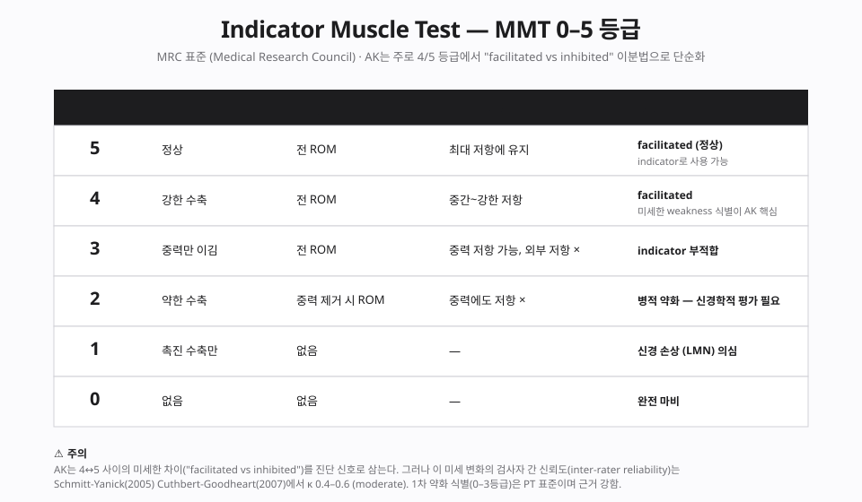
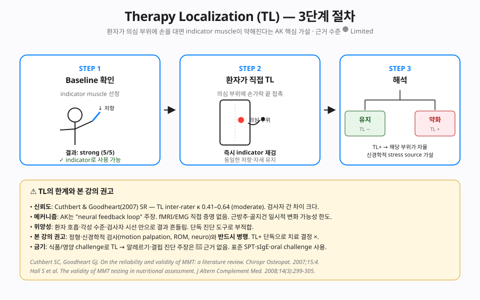
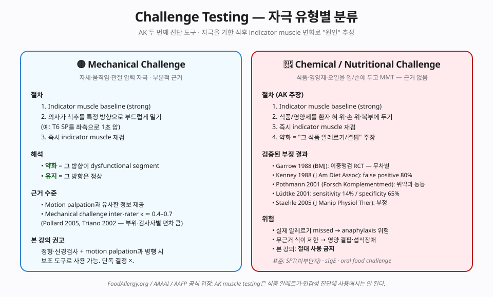
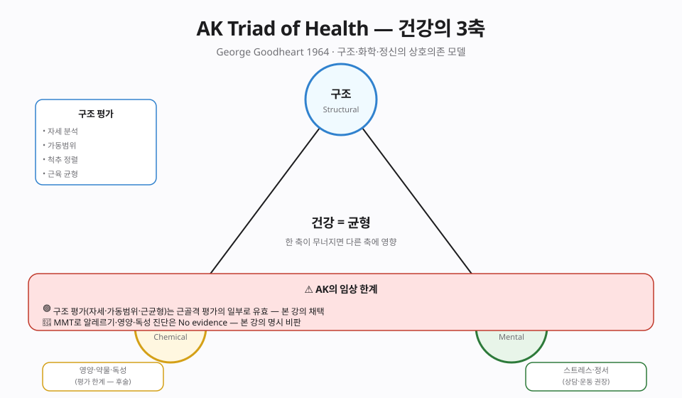
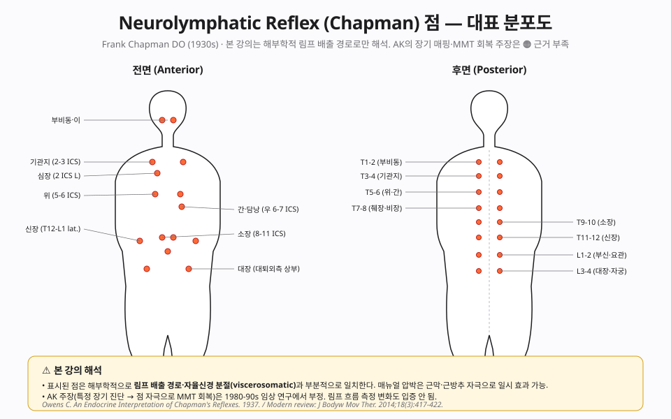
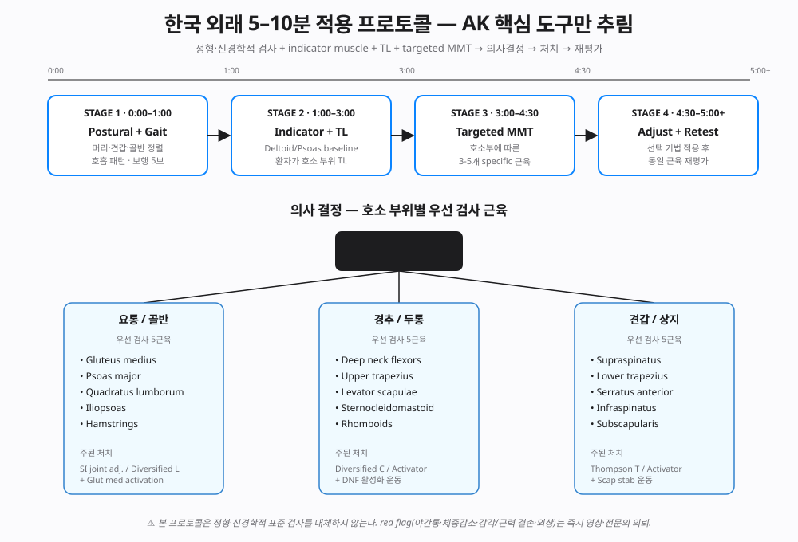

# Chapter 12. Applied Kinesiology (<abbr class="med-abbr" title="Applied Kinesiology · 응용 운동학 (George Goodheart, 1964)">AK</abbr>)

> **George Goodheart 1964 · <abbr class="med-abbr" title="Manual Muscle Testing · 도수 근력 검사">MMT</abbr> · 🟠 근력검사로 알레르기·영양·장기 진단은 제한적 근거 (다수 RCT 부정적) · 🔴 Switching / Cross-crawl만 1차 연구 자체 부재 · 🟡 MMT 자체의 근력 측정만 유용**
>
> **⚠️ 한국 임상에서 인지도 높지만 진단 확장 주장은 비판적 수용 필수**

---

## 📑 목차

1. [서론 — AK의 이중적 위상](#서론)
2. [역사 — George Goodheart와 AK의 탄생](#역사)
3. [MMT (Manual Muscle Testing)](#mmt)
4. **[진단 도구 11종 상세](#diagnostics)** 🆕
5. **[진단 가설 비교 매트릭스](#matrix)** 🆕
6. [5 Factors of IVF — AK 고유 이론](#5-factors)
7. [⚠️ Diagnostic Extension 주장과 비판적 검토](#diag-ext)
8. [⚠️ Food Allergy·영양 진단 주장 검토](#allergy)
9. **[현대 응용 — NKT·PRI·SFMA·FRC](#modern)** 🆕
10. **[5분 진료 프로토콜 (한국 외래용)](#protocol)** 🆕
11. [PMC·RCT 비판 리뷰](#rct)
12. [Aff/Def/Eff 해석](#aff-def-eff)
13. [한국 임상 맥락](#한국)
14. [결론 — 임상 권장 범위](#결론)
15. [참고 문헌](#참고문헌)

---

## 서론 — AK의 이중적 위상 {#서론}

**Applied Kinesiology (AK)**는 George Goodheart가 1964년 창시한 **수기 근력 검사 기반 진단·치료** 체계. 한국 임상에서 일부 수용·교육되고 있으나 **진단 확장 주장의 과학적 한계** 때문에 논쟁적.

### 두 부분으로 분리

본 강의는 AK를 **뚜렷이 두 부분**으로 나눠 다룸:

- 🟡 **채택**: MMT 자체의 근력 측정 기능 (재활의학의 표준 MMT와 동일)
- ⚠️ **현재 권장하지 않음**: "근력 변화로 알레르기·영양 결핍·장기 기능·감정 상태 진단" 주장 — 향후 연구로 평가가 달라질 가능성은 열어둡니다.

### FoodAllergy.org 공식 입장

미국 식품알레르기 연구·교육 단체 FoodAllergy.org는 AK를 **"Unproven Diagnostic Test"**로 분류 · 환자에게 AK 알레르기 진단 신뢰하지 말 것을 권고.

---

## 역사 — George Goodheart와 AK의 탄생 {#역사}

### George Goodheart, Jr., <abbr class="med-abbr" title="Doctor of Chiropractic · 카이로프랙틱 의사 학위">DC</abbr> (1918-2008)

- Detroit 개원 DC
- 1964 "근력 검사로 서브럭세이션 식별" 관찰 보고
- 1973 **International College of Applied Kinesiology (ICAK)** 설립
- **Touch for Health** (John Thie, 1970s) 등 파생 기법 다수

### 시간대별 확장

| 시기 | AK 주장 |
|------|---------|
| 1964-70 | 근력 검사로 **서브럭세이션 위치** 식별 |
| 1970s | 근육-장기 상관 차트 (Chapman reflex 차용) |
| 1980s | 영양 결핍·식품 감수성 진단 |
| 1990s+ | 감정·심리 상태·에너지 진단 확장 |

확장된 적용 영역으로 갈수록 현재까지 축적된 과학적 근거는 줄어드는 경향이 있습니다 (특히 1990s+ 감정·심리 영역).

### 파생·관련 기법

- **Professional AK (PAK)** — David Leaf
- **Touch for Health (TFH)** — John Thie (AK 단순화 대중용)
- **NeuroKinetic Therapy (NKT)** — David Weinstock
- **Clinical Kinesiology** — Alan Beardall

---

## MMT (Manual Muscle Testing) {#mmt}

### 🟡 재활의학 표준 MMT (인정되는 부분)

MMT 자체는 **재활의학·물리치료의 표준 평가 도구** (Daniels and Worthingham's Muscle Testing, Kendall's Muscles):

- 0 (수축 없음) - 5 (정상) grading
- 신경근 손상·말초 신경 장애·근육 병태 평가
- 🟢 Strong clinical utility in 재활의학

### 🟡 AK의 MMT 변형

- 환자 특정 자세 + 저항 부여 → "strong vs weak" 판정
- 🟡 단순 근력 측정은 유용
- 🟠 **그러나 "weak muscle"이 알레르기·장기 문제의 지표**라는 해석은 제한적 근거 (RCT 부정적 결과 다수)

### 재현성 연구

- Lawson & Calderon 1997: AK MMT inter-rater reliability 🟠 Limited
- Hsieh & Phillips 1990: 표준 MMT와 AK MMT 차이 구분 불명확
- Haas 2007 PMC: AK에 대한 비판적 검토
- Cuthbert & Goodheart 2007 (Chiropr Osteopat 15:4): AK MMT systematic review — κ 0.41–0.64 (moderate inter-rater), 1차 약화 식별에는 표준 MMT와 동등

---

## 진단 도구 11종 상세 {#diagnostics}

AK 임상가는 11개 진단 도구를 조합해 사용한다고 주장한다. 각 도구의 **절차 · 가설 · 근거 수준 · 본 강의 권장 범위**를 정리.

### 1. Manual Muscle Testing (MMT) — Indicator Muscle

**절차**

1. 환자의 한 근육을 baseline 강도(5/5)로 확인한다 (예: 견갑면 deltoid).
2. 의사가 일정한 방향·속도로 4초간 저항을 가한다 ("Press into my hand").
3. 환자가 그 저항을 견디는지(facilitated) 혹은 즉시 무너지는지(inhibited)를 본다.

**가설**: 척추·관절·내부 환경의 stress가 motor control center를 통해 indicator muscle 출력에 반영된다는 가정.

**근거 수준 🟡**: 1차 약화 식별(0-3 등급)은 PT 표준이며 근거 강함. AK 핵심인 4↔5 사이 미세 변화 식별은 검사자 간 신뢰도 κ 0.4-0.6.

**본 강의 권장**: 표준 14 근육 baseline은 routine으로 사용 가능. 단, "weak = 알레르기·장기 문제" 해석은 현재 근거가 부족하여 임상 적용을 권장하기 어렵습니다.

---

### 2. Therapy Localization (TL)

**절차** (그림 참조)

1. Indicator muscle baseline strong 확인.
2. **환자가 직접 자기 손가락 끝**으로 의심 부위(척추 분절·관절·림프점)에 가볍게 접촉.
3. 같은 자세 유지하며 즉시 indicator muscle 재검.
4. 약화되면 TL+, 그 부위가 "dysfunctional"로 판정.

**가설**: 신체가 무의식적으로 자기 부위의 문제를 인식하고 motor system을 통해 신호를 보낸다.

**근거 수준 🟠 Limited**: Cuthbert & Goodheart 2007에서 inter-rater κ 0.41-0.64. 시선·호흡·각성에 의해 흔들림.

**본 강의 권장**: motion palpation·neuro 검사와 **반드시 병행**. TL+ 단독으로 치료 결정 ×.

---

### 3. Challenge — Mechanical · Chemical 분리

**Mechanical Challenge 🟡 보조 사용 가능**

- 의사가 척추 분절을 특정 방향으로 1초간 짧게 밀고 즉시 indicator muscle 재검.
- 약화 = 그 방향이 listing 방향 (Gonstead·Diversified의 motion palpation과 유사한 정보).
- κ 0.4-0.7 (Pollard 2005, Triano 2002).

**Chemical / Nutritional / Oral Challenge ⚠️ 현재 임상 적용을 권장하기 어려움**

- 식품·영양제를 입·혀·손에 두고 indicator muscle 재검.
- 부정 RCT: Garrow 1988 (BMJ), Kenney 1988 (J Am Diet Assoc, false positive 80%), Pothmann 2001, Lüdtke 2001 (sensitivity 14%/specificity 65%), Staehle 2005.
- 표준은 SPT(피부단자) · sIgE · oral food challenge (반드시 임상 환경).

---

### 4. Triad of Health — Structural · Chemical · Mental

**개념 (Goodheart 1964)**: 건강은 구조(관절·근육·신경) + 화학(영양·환경) + 정신(스트레스·감정)의 균형. 한쪽이 무너지면 다른 쪽이 보상 시도하다 결국 전체 무너진다는 모델.

**임상 평가**: AK 임상가는 baseline weak muscle에 대해 세 영역 각각의 자극(척추 압박 · 영양제 oral · 정서 회상)을 시도해 어디서 회복되는지로 영역을 결정한다고 주장.

**근거 수준 🟡 개념 틀**: 개념 자체는 biopsychosocial model(Engel 1977)과 유사하므로 의미 있음. 그러나 "muscle test로 영역 결정"은 🟠 제한적 근거.

**본 강의 권장**: 환자 면담에서 세 영역을 모두 묻는 routine은 좋다. 그러나 결정은 표준 검사로.

---

### 5. 5 Factors of IVF

(아래 [5 Factors 섹션](#5-factors) 참조 — AK 고유 5요소 모델)

**근거 수준 🟠**: 5요소 중 4요소(neurolymphatic · neurovascular · CSF/cranial · nutrition)는 부분 근거 또는 근거가 매우 제한적인 상태입니다. 본 강의는 한의학 항목(meridian)을 다루지 않습니다.

---

### 6. Origin/Insertion Technique (O/I)

**절차**: AK는 약화 근육의 기시(origin)와 종지(insertion) 부착부를 손가락으로 강하게 압박·마찰한다 (deep digital pressure 5-10초).

**가설**: 근방추(muscle spindle)·골지건(Golgi tendon organ)을 reset → motor neuron 출력 정상화.

**근거 수준 🟡**: 부착부 자극은 myofascial release / trigger point release와 메커니즘 부분 일치. 일시적 통증 감소·ROM 증가 RCT 존재 (Hains 2002, Cagnie 2013).

**본 강의 권장**: 보조 도구로 사용 가능. 자극 후 능동 운동·재교육과 결합 필수.

---

### 7. Neurolymphatic Reflex (Chapman Reflex)

**역사**: Frank Chapman DO (1899-1932). 1930년대 신체 전·후면에 림프 회복점 60+ 개 매핑.

**절차**: 약화 indicator muscle 발견 → 해당 림프점(전면 ICS 사이·후면 척추 횡돌기 사이)을 손가락 끝으로 deep rotary rub 20-30초 → MMT 재검.

**가설 (AK)**: 림프 흐름 자극으로 장기·근육 기능 회복.

**근거 수준 🟠**: 1980-90 연구 부정적. 림프 흐름 측정 변화 입증 안 됨. 매뉴얼 압박이 근막·근방추 자극으로 일시 효과 가능성은 별개.

**본 강의 해석**: 표시된 점들이 해부학적으로 **림프 배출 경로·자율신경 분절(viscerosomatic)과 부분 일치**한다는 점만 인정. "장기 진단" 주장은 ×.

---

### 8. Neurovascular Reflex (Bennett Reflex)

**역사**: Terence Bennett DC (1880-1958). 두피·전두부에 작은 점들을 매핑.

**절차**: 극히 가벼운 압력 (피부 perceptible 정도) 30초~5분 유지. 두피 동맥 박동 변화를 의사가 감지한다고 주장.

**가설**: 자율신경계를 통한 장기 혈류 조절.

**근거 수준 🟠 Limited**: 직접 검증 연구가 매우 적고, 있더라도 두피 동맥 박동 변화의 임상 의미가 충분히 입증되지 않은 상태입니다 — peer-reviewed 1차 근거는 사실상 부족하나 부정적 결과를 보고한 연구도 존재합니다.

**본 강의 권장**: 현재로서는 권장하지 않습니다.

---

### 9. Spinal / Cranial Listing 진단

**AK 방식**: MMT 결과로 분절 listing(PRS, PLI 등)과 cranial bone 위치(temporal externally rotated 등)를 추정.

**근거 수준 🟠 Limited (cranial 부분은 부정적 데이터)**:
- 척추 listing은 X-ray + motion palpation이 표준 (Gonstead 챕터 4 참조).
- Cranial bone motion은 SOT-cranial과 동일한 비판이 적용 (Chapter 10 참조). 성인 두개골 봉합은 미세 movable하지만, 임상가가 그 movement를 손으로 진단할 수 있다는 inter-rater κ < 0.2 — 즉 부정적 1차 데이터는 있어 No evidence가 아닌 Limited 등급.

**본 강의 권장**: 척추 listing은 표준 motion palpation·X-ray로 평가합니다. Cranial 진단은 현재 근거가 제한적이어서 권장하지 않습니다.

---

### 10. ⚠️ Nutritional / Oral Provocation Testing

**AK 주장**: 식품·영양제·환경 화학물을 환자 혀·입·손·복부에 두고 indicator muscle test → 약화되면 "그 물질이 환자 시스템에 stress" → 알레르기·결핍·민감성 진단.

**검증된 부정 결과** (재차 강조):
- Garrow 1988 BMJ 296:1573-1574: 이중맹검 RCT
- Kenney 1988 J Am Diet Assoc 88(6):698-704: false positive 80%
- Pothmann 2001 Forsch Komplementmed 8(6):336-344: 위약과 동등
- Lüdtke 2001: sensitivity 14% / specificity 65% (chance below)
- Staehle 2005 J Manip Physiol Ther 28(2):e7

**유의점**: 실제 알레르기를 놓칠 경우 anaphylaxis 위험이 있고, 근거가 부족한 식이 제한은 영양 결핍·섭식장애로 이어질 수 있습니다.

**본 강의 권장**: 현재 임상 적용을 권장하지 않습니다. 식품 알레르기는 SPT · sIgE · oral food challenge 같은 표준 검사로 평가합니다.

---

### 11. ⚠️ Body Language / Switching / Cross-crawl

**Switching 가설**: 환자의 "polarity가 뒤집힌" 상태 → AK 검사가 모두 invalid → 환자 손바닥 비비기·복식 호흡으로 "리셋".

**Cross-crawl**: 좌우 교대 동작(좌팔+우다리)으로 hemispheric 통합 회복 주장.

**근거 수준 🔴 No evidence (AK 11종 중 유일)**: peer-reviewed 1차 연구가 매우 부족하고, 메커니즘이 아직 충분히 설명되지 않은 상태입니다. "polarity" 개념은 현재 측정이 어렵습니다. Cross-crawl 운동 자체는 coordination 훈련으로 의미를 가질 수 있으나, AK가 주장하는 효과(언어·학습장애 개선 등)는 현재 근거가 매우 제한적입니다. 본 챕터에서 유일하게 🔴 No evidence 등급으로 분류한 도구이며, 향후 연구에 따라 평가가 달라질 가능성은 열어둡니다.

**본 강의 권장**: 현재로서는 권장하지 않습니다.

---

## 진단 가설 비교 매트릭스 {#matrix}

| # | 진단 도구 | 가설 요지 | 절차 | 근거 수준 | 본 강의 입장 |
|---|---|---|---|---|---|
| 1 | **MMT (indicator)** | weak muscle = 시스템 stress 반영 | 표준 자세 + 4초 저항 | 🟡 1차 약화 식별 OK, 미세 변화 κ 0.4-0.6 | 표준 14근육 routine 가능 |
| 2 | **Therapy Localization** | 환자가 만지면 indicator 변화 | 환자 손가락 접촉 → 재검 | 🟠 Limited, κ 0.41-0.64 | 표준 검사 병행 시 보조 |
| 3a | **Mechanical Challenge** | 자극 방향이 listing 방향 | 척추 밀고 즉시 재검 | 🟡 κ 0.4-0.7 | motion palp과 병용 |
| 3b | **Chemical Challenge** | 식품/영양제로 약화 = 그 물질 문제 | 입/손에 두고 재검 | 🟠 다수 RCT 부정적 (Limited) | 현재 임상 적용을 권장하기 어려움 |
| 4 | **Triad of Health** | 구조·화학·정신 균형 | 영역별 자극 시 회복 측정 | 🟡 개념 OK, 진단 ×| 면담 frame으로만 |
| 5 | **5 Factors of IVF** | IVF 주변 5요인 분류 | 5요인 각각 검사 | 🟠 대부분 부정/제한적 | meridian 명시 제외 |
| 6 | **Origin/Insertion** | 근방추·GTO reset | 부착부 deep pressure | 🟡 myofascial과 유사 | 보조 도구 가능 |
| 7 | **Neurolymphatic (Chapman)** | 림프 흐름 회복 | 점 deep rub 20-30s | 🟠 림프 측정 변화 ×; 근막 자극 효과 ○ | 해부학적 압박 효과만 인정 |
| 8 | **Neurovascular (Bennett)** | 두피점 → 자율신경 → 장기 혈류 | 두피 점 가벼운 압 30s-5m | 🟠 임상 의미 미입증 (Limited) | 현재 권장하지 않음 |
| 9 | **Spinal/Cranial Listing** | MMT로 listing 진단 | MMT + 자세 변경 | 🟠 cranial κ 부정; 척추는 표준 도구 | 표준 motion palp·X-ray |
| 10 | **Nutrition/Oral** | 식품·영양제 알레르기·결핍 진단 | 입에 두고 MMT | 🟠 다수 RCT 부정적 (Garrow, Kenney, Pothmann, Lüdtke) | 현재 임상 적용을 권장하기 어려움 |
| 11 | **Switching/Cross-crawl** | polarity reset · hemisphere 통합 | 호흡·교대 운동 | 🔴 No evidence — peer-reviewed 1차 연구가 매우 부족 | 현재 권장하지 않음 |

**색 범례**: 🟢 Strong · 🟡 Moderate · 🟠 Limited · 🔴 No / Negative evidence

---

AK는 Intervertebral Foramen (IVF) 주변의 **5가지 요소**가 기능장애를 일으킨다고 주장:

1. **Nerve** — 신경 압박 (기계적)
2. **Neurolymphatic (Chapman Reflex)** — 림프 반사점
3. **Neurovascular (Bennett Reflex)** — 혈관 반사점
4. **Cerebrospinal Fluid (CSF)** — CSF 흐름

### 🔴 평가

| 요소 | 과학적 평가 |
|------|------------|
| Nerve 압박 | 🟢 인정 (표준 신경과·정형외과 개념) |
| Chapman Reflex | 🟠 해부학적 논쟁 (StatPearls 부분적 언급, 임상 유용성 제한) |
| Bennett Reflex | 🟠 제한적 (직접 검증 연구 거의 없음) |
| CSF 흐름과 척추 분절 | 🟠 제한적 (cranial 연구 κ < 0.2, 임상 유효성 낮음) |

### 본 강의 입장

5 Factors 중 Nerve 요소만 🟢 수용 · 나머지 4개는 🔴 제외

---

## ⚠️ Diagnostic Extension 주장과 비판적 검토 {#diag-ext}

### AK 확장 진단 주장

- 특정 근육이 "weak" → 해당 장기 기능 저하
- 예: **Pectoralis major clavicular → 위(stomach)**, **Latissimus dorsi → 췌장(pancreas)**, **Teres minor → 갑상선(thyroid)**
- 근육-장기 상관 차트 전신 적용

### 🔴 과학적 비판

1. **해부학·생리학 근거 부재** — 개별 근육과 장기 기능의 이런 직접적 연결은 표준 의학에서 인정되지 않음
2. **Ideomotor effect** — AK "testing" 중 술자의 무의식적 힘 조절이 결과를 결정 (Hyman 2003·Schwartz 2014)
3. **Double-blind <abbr class="med-abbr" title="Randomized Controlled Trial · 무작위대조군시험">RCT</abbr> 부정적**:
   - Kenney JJ et al. 1988 — AK allergy detection 효과 입증 부족
   - Staehle HJ et al. 2005 — 치과 재료 과민성 AK로 검출 불가
4. **PMC scoping review** (Haas 2007 재검토): 이론적 근거 약함

---

## ⚠️ Food Allergy·영양 진단 주장 검토 {#allergy}

### 주장

- 환자가 음식·영양제·약 샘플을 들고 MMT 수행
- 근력이 weak → 해당 물질 알레르기·유해
- 근력 strong → 안전·유익

### 🔴 과학적 검증

- **FoodAllergy.org 공식 지정**: "Unproven Diagnostic Test"
- American Academy of Allergy, Asthma & Immunology (AAAAI) 동일 입장
- 이중맹검 RCT에서 일관된 부정적 결과

### 🔴 위험성

- 실제 IgE 매개 알레르기 환자가 AK로 "safe" 판정 → **아나필락시스 위험**
- 영양 결핍 진단 오류 → 적절 치료 지연
- 환자 비용 낭비

### 본 강의 명시 경고

AK로 알레르기·영양 결핍·장기 질환을 진단하지 말 것. 신뢰할 진단은:
- **알레르기**: 혈청 특이 IgE·피부 반응 검사
- **영양 결핍**: 혈청 영양소 농도 측정
- **장기 기능**: 표준 의학 검사 (LFT·신장·갑상선 등)

---

## 현대 응용 — NKT · PRI · SFMA · FRC {#modern}

AK의 일부 도구(특히 표준 MMT + indicator muscle 개념)는 21세기 들어 PT·sports medicine 영역에서 **운동학적 진단 체계**로 재해석·정교화됐다. 본 강의는 AK의 원형보다 이쪽 현대 응용을 더 권장한다 — 근거 기반 더 강하고 한의학·vitalism 잔재가 없다.

### 비교표

| 기법 | 창시자·연도 | 핵심 가설 | 검사 도구 | AK와의 관계 | 근거 수준 |
|---|---|---|---|---|---|
| **NKT** (Neurokinetic Therapy) | David Weinstock, 2007 | motor control center에 잘못된 compensation 패턴 저장 | MMT antagonist/synergist pair · release dysfunctional → retrain inhibited | AK MMT의 직계 — antagonist 검사 추가 | 🟠 사례 보고 多 · RCT 부족 |
| **PRI** (Postural Restoration) | Ron Hruska, 1989 | 좌측 AIC pattern · 호흡·횡격막·골반 비대칭 | 자세 patterning test · ZOA test · 호흡 평가 | 독립 발전 — MMT 일부 차용 | 🟡 lumbopelvic pain RCT 일부 양성 |
| **SFMA** (Selective Functional Movement Assessment) | Gray Cook, 2000s | Mobility vs Stability dysfunction 이분 | 7 movement patterns + breakouts | AK와 독립 — PT 표준 | 🟡 reliability moderate-good (κ 0.6+) |
| **FRC** (Functional Range Conditioning) | Andreo Spina, 2010s | controlled articular function 부재 | CARs · PAILs/RAILs · joint capsule test | 독립 — joint focus | 🟠 메커니즘 plausible · RCT 부족 |

### NKT — Neurokinetic Therapy

**핵심 절차**:
1. 환자 호소 부위의 관련 근육 MMT (표준)
2. 약화된 근육의 antagonist·synergist를 차례로 MMT
3. "잘못 facilitated된" 근육(원래 약해야 할 자세에서 강한 근육) 발견
4. 그 근육을 release(stretch·pin&move) → 원래 약했던 근육 retest → 회복 확인

**AK와 차이**: AK는 "약화 muscle의 원인을 척추·림프·영양 등 외부 요인에 둠". NKT는 "compensation 패턴 자체에 집중" — 더 motor learning theory에 부합.

**근거**: Weinstock 책 외 RCT 거의 없음. 그러나 motor control 이론 측면 plausibility 높다. PT 임상가들이 활발히 사용 중.

### PRI — Postural Restoration

**핵심 가설**: 인간 신체는 좌우 비대칭 (간이 우측·심장 좌측·횡격막 좌·우 다름). 이 비대칭이 호흡·자세 패턴에 영향 → 만성 통증·기능장애 유발.

**대표 평가**:
- Adduction Drop Test (좌 vs 우 ROM 차이)
- ZOA (Zone of Apposition) 호흡 평가
- Hruska Abduction Lift Test

**근거**: lumbopelvic 통증·만성 호흡 부전에서 일부 RCT 양성 (Boyle 2010, Skoglund 2011). PT 교육 표준 일부 통합.

**AK와 관계**: 직접적 계승 ×. 그러나 "테스트 → 패턴 식별 → 처치 → 재테스트" 사이클 구조는 유사.

### SFMA — Selective Functional Movement Assessment

**구조**: 7 movement patterns(경부·상지·다중-segmental 굴곡/신전/회전·overhead deep squat·single-leg stance) → 각각 functional vs dysfunctional, painful vs nonpainful → breakouts으로 mobility/stability 구분.

**근거**: Glaws 2014, Frohm 2012 (SFMA reliability moderate-good κ 0.6+). 스포츠·재활 표준에 안착.

**AK와 차이**: SFMA는 **정형 운동학적** 평가 — MMT는 보조. AK MMT는 정확도 측면에서 SFMA breakout에 통합되지 않음.

### FRC — Functional Range Conditioning

**핵심**: 각 관절의 controlled articular function 회복.
- **CARs** (Controlled Articular Rotations): active ROM at end range
- **PAILs/RAILs**: progressive isometric loading at end range
- **Joint capsule test**: passive ROM vs active end range gap

**근거**: 메커니즘(연골·관절낭 mechanotransduction) plausible. RCT는 신생 단계.

**AK와 관계**: 직접적 계승 ×. 단, "약화 → 능동 재교육" 철학 공유.

### 본 강의 권장

- **routine PT 평가**: SFMA + 표준 MMT 14근육
- **요통·골반**: PRI 좌측 AIC 검사 + Diversified 보강
- **만성 motor pattern 문제**: NKT antagonist 검사
- **관절 가동성 회복**: FRC CARs 운동

AK 단독보다 위 4종을 환자 호소에 따라 조합하는 것이 evidence·재현성 측면에서 우월.

---

## 5분 진료 프로토콜 (한국 외래용) {#protocol}

한국 외래는 5-10분 단위로 환자 회전이 빠르다. AK 원전의 30-60분 protocol은 비현실적. 핵심 도구만 추려 **5분 protocol**로 압축.

### 단계 시간표

| Stage | 시간 | 작업 | Tool |
|---|---|---|---|
| 1 | 0:00-1:00 | Postural + Gait quick screen | 머리·견갑·골반 정렬 · 호흡 패턴 · 보행 5보 |
| 2 | 1:00-3:00 | Indicator + TL | Deltoid/Psoas baseline → 환자 호소 부위 TL |
| 3 | 3:00-4:30 | Targeted MMT | 호소 부위별 3-5근육 (아래 참조) |
| 4 | 4:30-5:00+ | Adjust + Retest | 선택 기법 → 동일 근육 재평가 |

### 호소 부위별 우선 검사 5근육

#### 요통 / 골반
1. Gluteus medius — 측와위·고관절 외전 저항
2. Psoas major — 앙와위·고관절 굴곡 + 외회전 저항
3. Quadratus lumborum — 측와위·체간 측굴 저항
4. Iliopsoas — 좌위·고관절 굴곡 저항
5. Hamstrings — 복와위·슬굴곡 저항

**주 처치**: SI joint adjustment (Diversified or Thompson) + Glut med activation 운동

#### 경추 / 두통
1. Deep neck flexors (DNF) — chin tuck holding test
2. Upper trapezius — 좌위·견갑 거상 저항
3. Levator scapulae — 좌위·견갑 상방 회전 저항
4. Sternocleidomastoid — 앙와위·경부 굴곡+회전 저항
5. Rhomboids — 좌위·견갑 후인 저항

**주 처치**: Diversified C / Activator + DNF 활성화 운동

#### 견갑 / 상지
1. Supraspinatus — 견갑면 외전 저항 (Jobe/empty can test 변형)
2. Lower trapezius — 복와위·견갑 후하방 저항
3. Serratus anterior — push-up plus position
4. Infraspinatus — 외회전 저항 (90° 굴곡)
5. Subscapularis — Lift-off test 또는 belly press

**주 처치**: Thompson T / Activator + Scapular stability 운동

### Red Flag 즉시 중단

본 프로토콜은 정형·신경학적 표준 검사를 **대체하지 않는다**. 아래 발견 시 즉시 영상·전문의 의뢰:

- **야간통** + 체중 감소 → 종양·감염 의심
- **발열** + 척추 통증 → osteomyelitis · discitis
- **외상력** + 신경학적 결손 → 골절·척수 압박
- **Saddle anesthesia** + 배뇨/배변 장애 → cauda equina (응급)
- **진행성 근력 저하** (시간 단위 악화) → 척수 압박

### 임상 case 2건

#### Case 1 — 30세 여성, 만성 우측 요통 (3개월)

- **0-1분**: 우측 골반 거상 / 좌측 어깨 하강 / 보행 시 우측 stance phase 짧음
- **1-3분**: Deltoid baseline 5/5. 우측 SI joint TL → 약화 (TL+)
- **3-4:30분**: 우측 Glut med 3/5 / Psoas 우 4/5 / 좌 Quad lumb 4/5
- **4:30-5분**: 우측 SI Diversified adjust → Glut med retest 4+/5 → home exercise (clamshell 좌우 2×15)

#### Case 2 — 40세 남성, 좌측 어깨 통증 (운동 후 3주)

- **0-1분**: 좌측 견갑 anterior tilt / scapular dyskinesis
- **1-3분**: Deltoid baseline 우 5/5 / 좌 4/5. 좌측 supraspinatus TL → 즉시 약화
- **3-4:30분**: 좌 supraspinatus 4-/5 · lower trapezius 3+/5 · serratus anterior 4-/5
- **4:30-5분**: T3-T5 Thompson + lower trap 활성화 (prone Y) 2×10 → retest serratus 4+/5

---

## PMC·RCT 비판 리뷰 {#rct}

### 주요 부정적 연구

1. **Garrow JS.** Kinesiology and food allergy. *BMJ* 1988;296:1573-1574. — 이중맹검 RCT 부정적
2. **Kenney JJ et al.** Applied kinesiology unreliable for assessing nutrient status. *J Am Diet Assoc* 1988.
3. **Staehle HJ et al.** Applied kinesiology in dental testing: a double-blind randomized trial. *Complement Med Res* 2005. — 부정적
4. **Haas M et al.** Applied kinesiology critique. *PMC* 2007.
5. **Pothmann R et al.** Validation of AK for food allergy testing in children. 소규모·제한적.
6. **Schwartz SA et al.** Applied kinesiology — a follow-up study. *J Manipulative Physiol Ther* 2014.
7. **Systematic review** — Disentangling manual muscle testing and Applied Kinesiology: critique and reinterpretation. *PMC*.

### 긍정적 연구

- 일부 sub-clinical musculoskeletal 연관 연구에서 AK MMT가 <abbr class="med-abbr" title="Spinal Manipulative Therapy · 척추 도수 치료">SMT</abbr> 효과 평가에 유용할 수 있다는 증례 존재 (🟠 Limited)
- 그러나 알레르기·영양·장기 진단에 대해서는 없음

---

## Aff/Def/Eff 해석 {#aff-def-eff}

### MMT의 Aff/Def/Eff

- MMT 시 근방추·GTO 자극 → 구심성 입력
- 피질·소뇌 통합 후 원심 운동 출력
- AK "testing" 결과는 **술자·환자의 상호 작용**이 많이 반영 (ideomotor)

### AK 치료 요소

- 척추 교정 (<abbr class="med-abbr" title="High-Velocity Low-Amplitude · 고속·저진폭 수기 교정">HVLA</abbr> 유사)
- Chapman reflex point 자극 (🟠 효과 불명확)
- 영양 처방 (AK 진단 기반 시 ⚠️ 현재 권장하기 어려움)
- 스트레스 관리·감정 해소 주장 (🟠 Limited — relaxation 일반 효과는 알려져 있으나 AK 특이 효과 미증명)

---

## 한국 임상 맥락 {#한국}

### 인지도

- 한국 일부 DC·도수치료사(PT)가 AK 교육 이수
- 정형외과·재활의학과 의사 일부 AK 개념 노출

### 한국 현장의 문제점

- 알레르기·영양 AK 진단의 무분별 수용 사례
- 환자 의료 혼선 (표준 진단 검사 지연)
- 근거 기반 의학(<abbr class="med-abbr" title="Evidence-Based Medicine · 근거 기반 의학">EBM</abbr>) 원칙과 충돌

### 본 강의 권고

- 한국 의사·PT 대상 강의에서 AK를 다룰 때:
  - 🟡 MMT 기본 원리는 재활의학 MMT와 동일 — 학습 가치
  - 🟠 AK 확장 진단 주장은 **제한적 근거(다수 RCT 부정적)** · 🔴 Switching/Cross-crawl만 1차 연구 자체 부재 — 임상 적용 제외 교육
  - 환자에게 AK 진단을 표준 의학 진단 대체로 쓰지 말 것 강조

---

## 결론 — 임상 권장 범위 {#결론}

### 🟡 본 강의가 권장하는 AK 활용

- **재활의학 표준 MMT** — 근력 평가
- 근육-척추 분절 연관에 대한 **해부학적 학습** (Wyke 4 유형과 연결)

### ⚠️ 본 강의가 현재로서는 권장하지 않는 AK 주장

(향후 추가 연구로 평가가 달라질 가능성은 열어두며, 지금 시점의 근거 수준에 따른 권고)

- 근력검사로 알레르기 진단
- 근력검사로 영양 결핍·장기 기능 진단
- 근력검사로 감정·정신 문제 진단
- 음식·약·영양제를 몸에 대고 근력 변화로 "안전·유해" 판단
- Chapman reflex·Bennett neurovascular·CSF 관련 확장 주장
- AK 진단으로 표준 의학 검사를 대체하는 사용

### 🟢 안전한 통합

한국 임상에서 AK 교육 이수자가 도수치료·카이로프랙틱 시술을 할 때, **MMT 결과는 근력 평가로만** 활용하고, 진단은 **표준 의학 절차** (혈액·영상·면역 검사)에 의뢰하는 것이 환자 안전·법적 보호 측면에서 권장.

---

## 참고 문헌 {#참고문헌}

### 원전

1. Goodheart GJ. *Applied Kinesiology Research Manuals*. Privately published, 1964-1998.
2. Walther DS. *Applied Kinesiology Synopsis*. Systems DC, 2000.
3. Leaf D. *Applied Kinesiology Flowchart Manual*. 2005.

### 🔴 비판적 검토

4. **Garrow JS.** Kinesiology and food allergy. *BMJ* 1988;296:1573-1574.
5. **Kenney JJ et al.** Applied kinesiology unreliable for assessing nutrient status. *J Am Diet Assoc* 1988.
6. **Staehle HJ et al.** Applied kinesiology in dental testing — a randomized double-blind trial. *Complement Med Res* 2005.
7. **Haas M et al.** Status of applied kinesiology. *PMC* 2007.
8. **Pothmann R et al.** Validation of applied kinesiology for children with food allergies. Small study.
9. **Schwartz SA et al.** Applied kinesiology — a follow-up study. *JMPT* 2014.
10. **PMC scoping review**: Disentangling MMT and AK.

### 🔴 공식 의료 단체 입장

11. [FoodAllergy.org — Unproven Diagnostic Tests](https://www.foodallergy.org/)
12. American Academy of Allergy, Asthma & Immunology (AAAAI) position statements.

### 해부학적 참고

13. **StatPearls** — Chapman's Points · Physiology review (NCBI Bookshelf)

### 조직

14. [International College of Applied Kinesiology USA](https://icakusa.com/)
15. [ICAK Worldwide](https://www.icak.com/)

### 한국 맥락

---

**이전**: [Ch 11. Harrison CBP](../cbp/lecture/chapter11_cbp.md) · **🏠 메인**: [index.html](../../index.html)

**편집**: Dr. Jang · 2026-04-22 · v1.0 skeleton
**마지막 챕터 — 커리큘럼 완료** 🎉
